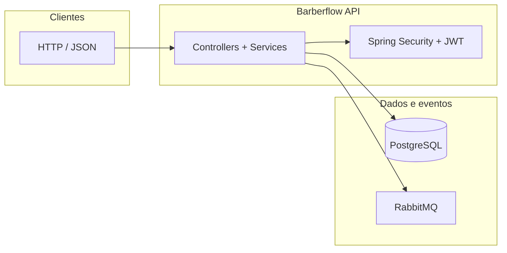

# Barberflow API

API REST para agendamento em barbearia: cadastro e autenticação com JWT, perfis **CLIENT** e **BARBER**, disponibilidade de horários, marcação de atendimentos e mensageria assíncrona com RabbitMQ. Projeto pensado como **referência de estudo** em Spring Boot com empacotamento Docker e deploy em ambientes como Railway.

---

## Sumário

- [Stack](#stack)
- [Arquitetura (visão geral)](#arquitetura-visão-geral)
- [Pré-requisitos](#pré-requisitos)
- [Execução rápida com Docker](#execução-rápida-com-docker)
- [Variáveis de ambiente](#variáveis-de-ambiente)
- [Perfis Spring (`dev` / `prod`)](#perfis-spring-dev--prod)
- [Documentação OpenAPI (Swagger)](#documentação-openapi-swagger)
- [Contratos e convenções](#contratos-e-convenções)
- [CI](#ci)
- [Deploy (Railway e similares)](#deploy-railway-e-similares)
- [Estrutura do repositório](#estrutura-do-repositório)

---

## Stack

| Camada | Tecnologia |
|--------|------------|
| Runtime | Java **17**, Spring Boot **3.5.x** |
| Persistência | Spring Data JPA, Hibernate, **PostgreSQL** |
| Segurança | Spring Security, **JWT** (stateless), BCrypt |
| Mensageria | Spring AMQP, **RabbitMQ** |
| Documentação | **SpringDoc OpenAPI** 2.x (Swagger UI) |
| Build | Maven (wrapper incluído) |
| Container | Docker multi-stage (`eclipse-temurin:17-jdk`) |

---

## Arquitetura (visão geral)



- **Autenticação:** rotas públicas em `/auth/**`; demais endpoints exigem `Authorization: Bearer <token>`.
- **Domínio:** usuários podem iniciar como cliente e promover a barbeiro (`PATCH /users/me/become-barber`); barbeiros definem agenda e geram slots de disponibilidade; clientes criam agendamentos sobre slots livres.
- **Eventos:** criação e cancelamento de agendamentos publicam eventos para filas configuradas no RabbitMQ (consumidores no próprio serviço).

---

## Pré-requisitos

- **Docker** e **Docker Compose** (recomendado para subir tudo localmente), ou
- **JDK 17** + **Maven** + instâncias próprias de PostgreSQL e RabbitMQ.

---

## Execução rápida com Docker

Na raiz do repositório:

```bash
docker compose up --build
```

- API: **http://localhost:8080**
- Swagger UI: **http://localhost:8080/swagger-ui.html**
- OpenAPI JSON: **http://localhost:8080/v3/api-docs**
- PostgreSQL (host): porta **5433** → container `5432`
- RabbitMQ management UI: **http://localhost:15672** (usuário/senha padrão `guest` / `guest`, conforme imagem)

O perfil ativo no Compose é **`dev`** (DDL `update`, SQL de diagnóstico habilitado no `application-dev.properties`).

---

## Variáveis de ambiente

### Obrigatórias em produção (`prod`)

| Variável | Descrição |
|----------|-----------|
| `SPRING_PROFILES_ACTIVE` | Use `prod`. |
| `JWT_SECRET` | Segredo HMAC para assinatura do JWT (valor longo e aleatório). |
| `DB_URL` | JDBC PostgreSQL, ex.: `jdbc:postgresql://host:5432/barberflow` |
| `DB_USERNAME` | Usuário do banco. |
| `DB_PASSWORD` | Senha do banco. |
| `RABBITMQ_HOST` | Host do RabbitMQ. |
| `RABBITMQ_PORT` | Porta AMQP (geralmente `5672`). |
| `RABBITMQ_USERNAME` | Usuário AMQP. |
| `RABBITMQ_PASSWORD` | Senha AMQP. |

### Opcionais (Swagger em produção)

Por padrão, em `prod`, a documentação Swagger/OpenAPI fica **habilitada** para facilitar demos. Para desativar:

| Variável | Valor |
|----------|--------|
| `SPRINGDOC_SWAGGER_UI_ENABLED` | `false` |
| `SPRINGDOC_API_DOCS_ENABLED` | `false` |

### Compose local (`dev`)

O arquivo `docker-compose.yml` define exemplos de `JWT_SECRET`, `DB_*` e `SPRING_RABBITMQ_*`. **Não reutilize esses valores em produção.**

---

## Perfis Spring (`dev` / `prod`)

| Aspecto | `dev` | `prod` |
|---------|--------|--------|
| DDL Hibernate | `update` | `validate` |
| SQL no log | ligado | desligado |
| Swagger | herdado das configs globais | igual; pode ser desligado pelas env vars acima |
| Cabeçalhos de proxy | — | `server.forward-headers-strategy=framework` (útil atrás de reverse proxy) |

---

## Documentação OpenAPI (Swagger)

- UI interativa: `/swagger-ui.html` (redireciona para o bundle atual do SpringDoc).
- Esquema: `/v3/api-docs`.

Autenticação na UI: execute `POST /auth/login`, copie o **token** retornado e use **Authorize** com esquema Bearer.

Datas no contrato seguem **hora local sem sufixo de fuso** (`yyyy-MM-dd'T'HH:mm:ss`), alinhadas entre disponibilidade, agendamentos e payload de erro (`ErrorResponse`).

---

## Contratos e convenções

- **Erros:** corpo JSON `ErrorResponse` com `timestamp`, `status`, `error`, `message`, `path`.
- **HTTP:** uso típico de `400` (regra de negócio / validação), `401` (credenciais ou JWT inválido), `403` (papel ou autorização), `404`, `409` (conflito, ex.: slot já reservado).

Detalhes por endpoint estão documentados de forma enxuta no OpenAPI (auth, agendamentos, disponibilidade e fluxo de promoção a barbeiro).

---

## CI

GitHub Actions (`.github/workflows/maven.yml`): em pull requests para `master`, executa `mvn -B package`.  
Os testes automatizados (`mvn test`) estão comentados no workflow até haver suporte a perfil/banco em ambiente de CI.

---

## Deploy (Railway e similares)

1. Defina `SPRING_PROFILES_ACTIVE=prod` e todas as variáveis obrigatórias da tabela acima.
2. Use o **Dockerfile** na raiz (build Maven dentro da imagem; porta **8080**).
3. Garanta PostgreSQL e RabbitMQ acessíveis com as URLs/credenciais corretas (`DB_*`, `RABBITMQ_*`).
4. Se a doc Swagger não for desejada em produção, defina as duas variáveis `SPRINGDOC_*` como `false`.

---

## Estrutura do repositório

```
├── Dockerfile
├── docker-compose.yml
├── pom.xml
└── src/main/java/com/azevedo/barberflow/
    ├── config/          # OpenAPI, conversores de modelo p/ documentação
    ├── controller/      # REST
    ├── domain/          # entidades e enums
    ├── dto/             # request/response records
    ├── exception/       # exceções + @RestControllerAdvice
    ├── messaging/       # RabbitMQ (config, producer, consumer, eventos)
    ├── repository/      # Spring Data JPA
    ├── security/        # JWT, filtros, SecurityFilterChain
    └── service/         # regras de negócio
```

---

## Licença

Este repositório não inclui arquivo de licença por padrão. Defina uma licença conforme o uso pretendido.
